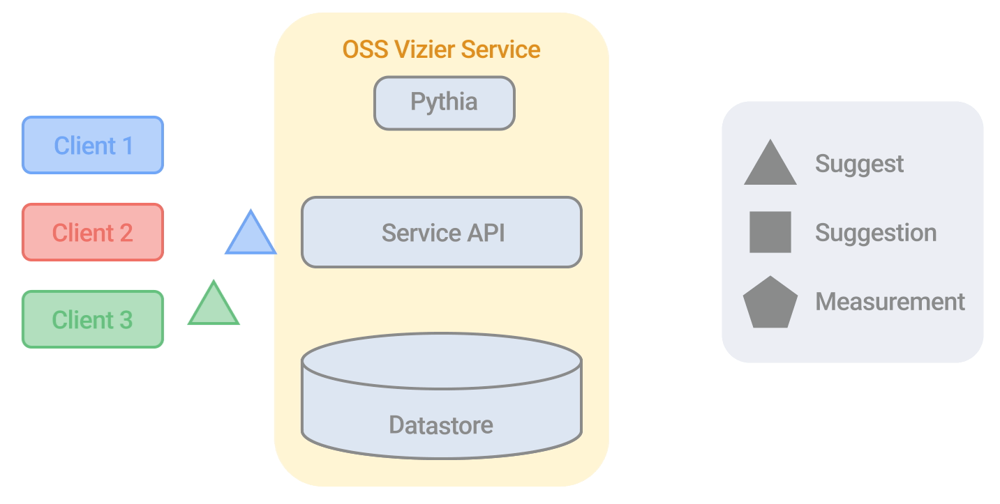

<figure>

</figure>

# Open Source Vizier: Otimização de caixa preta confiável e flexível.
[](https://badge.fury.io/py/google-vizier)


  [**Google AI Blog**](https://ai.googleblog.com/2023/02/open-source-vizier-towards-reliable-and.html)
| [**Getting Started**](#getting_started)
| [**Documentation**](#documentation)
| [**Installation**](#installation)
| [**Citing Vizier**](#citing_vizier)

## O que é Vizier de código aberto (OSS)?
[OSS Vizier](https://arxiv.org/abs/2207.13676) é um serviço baseado em Python para otimização e pesquisa de caixa preta, baseado no [Google Vizier](https://dl.acm.org/doi/10.1145/3097983.3098043), um dos primeiros serviços de ajuste de hiperparâmetros projetados para funcionar em escala .
<figure>
<p align="center" width=65%>

  <br>
  <em><b>Sistema cliente-servidor distribuído do OSS Vizier. Animação de Tom Small.</b></em>
</p>
</figure>

## Começando <a name="getting_started"></a>
Como um exemplo básico para os usuários, abaixo mostramos como ajustar um objetivo simples usando todos os tipos de espaço de pesquisa plana:

```python
from vizier.service import clients
from vizier.service import pyvizier as vz

# Função objetivo para maximizar.
def evaluate(w: float, x: int, y: float, z: str) -> float:
  return w**2 - y**2 + x * ord(z)

# Algoritmo, espaço de pesquisa e métricas.
study_config = vz.StudyConfig(algorithm=vz.Algorithm.GAUSSIAN_PROCESS_BANDIT)
study_config.search_space.root.add_float_param('w', 0.0, 5.0)
study_config.search_space.root.add_int_param('x', -2, 2)
study_config.search_space.root.add_discrete_param('y', [0.3, 7.2])
study_config.search_space.root.add_categorical_param('z', ['a', 'g', 'k'])
study_config.metric_information.append(vz.MetricInformation('metric_name', goal=vz.ObjectiveMetricGoal.MAXIMIZE))

# Configure o cliente e comece a otimização. O Serviço Vizier será criado implicitamente.
study = clients.Study.from_study_config(study_config, owner='my_name', study_id='example')
for i in range(10):
  suggestions = study_client.suggest(count=1)
  for suggestion in suggestions:
    params = suggestion.parameters
    objective = evaluate(params['w'], params['x'], params['y'], params['z'])
    suggestion.complete(vz.Measurement({'metric_name': objective}))
```

## Documentação <a name="documentation"></a>
A interface do OSS Vizier consiste em [três APIs principais](https://oss-vizier.readthedocs.io/en/latest/guides/index.html):

* [**User API:**](https://oss-vizier.readthedocs.io/en/latest/guides/index.html#for-users) Permite que um usuário configure um OSS Vizier Server, que pode hospedar algoritmos de otimização de caixa preta para atender a vários clientes simultaneamente de maneira tolerante a falhas para ajustar suas funções objetivas.
* [**Developer API:**](https://oss-vizier.readthedocs.io/en/latest/guides/index.html#for-developers) Define abstrações e utilitários para implementar novos algoritmos de otimização para pesquisa e para serem hospedados no serviço.
* [**Benchmarking API:**](https://oss-vizier.readthedocs.io/en/latest/guides/index.html#for-benchmarking) Uma ampla coleção de funções objetivas e métodos para avaliar e comparar algoritmos.

Além disso, contém [API avançada](https://oss-vizier.readthedocs.io/en/latest/advanced_topics/index.html) para:

* [**Tensorflow Probability:**](https://oss-vizier.readthedocs.io/en/latest/advanced_topics/index.html#tensorflow-probability) Para escrever algoritmos de otimização bayesiana usando Tensorflow Probability e Flax.
* [**PyGlove:**](https://oss-vizier.readthedocs.io/en/latest/advanced_topics/index.html#pyglove) Para experimentação evolutiva em larga escala e pesquisa de programas usando o OSS Vizier como um back-end distribuído.

Please see OSS Vizier's [ReadTheDocs documentation](https://oss-vizier.readthedocs.io/) for detailed information.

## Installation <a name="installation"></a>
**Most common:** To tune objectives using our default state-of-the-art JAX-based Bayesian Optimizer, run:

```bash
pip install google-vizier[jax]
```

To install a **minimal version** that consists of only the core service and client API from `requirements.txt`, run:

```bash
pip install google-vizier
```

For **full installation** to support all algorithms and benchmarks, run:

```bash
pip install google-vizier[extra]
```

For **specific installations**, you can run:

```bash
pip install google-vizier[X]
```

which will install additional packages from `requirements-X.txt`, such as:

* `requirements-jax.txt`: Jax libraries shared by both algorithms and benchmarks.
* `requirements-tf.txt`: Tensorflow libraries used by benchmarks.
* `requirements-algorithms.txt`: Additional repositories (e.g. EvoJAX) for algorithms.
* `requirements-benchmarks.txt`: Additional repositories (e.g. NASBENCH-201) for benchmarks.
* `requirements-test.txt`: Libraries needed for testing code.

Check if all unit tests work by running `run_tests.sh` after a full installation. OSS Vizier requires Python 3.10+, while client-only packages require Python 3.7+.

## Citing Vizier <a name="citing_vizier"></a>
If you found this code useful, please consider citing the [OSS Vizier paper](https://arxiv.org/abs/2207.13676) as well as the [Google Vizier paper](https://dl.acm.org/doi/10.1145/3097983.3098043). Thanks!

```
@inproceedings{oss_vizier,
  author    = {Xingyou Song and
               Sagi Perel and
               Chansoo Lee and
               Greg Kochanski and
               Daniel Golovin},
  title     = {Open Source Vizier: Distributed Infrastructure and API for Reliable and Flexible Black-box Optimization},
  booktitle = {Automated Machine Learning Conference, Systems Track (AutoML-Conf Systems)},
  year      = {2022},
}
@inproceedings{google_vizier,
  author    = {Daniel Golovin and
               Benjamin Solnik and
               Subhodeep Moitra and
               Greg Kochanski and
               John Karro and
               D. Sculley},
  title     = {Google Vizier: {A} Service for Black-Box Optimization},
  booktitle = {Proceedings of the 23rd {ACM} {SIGKDD} International Conference on
               Knowledge Discovery and Data Mining, Halifax, NS, Canada, August 13
               - 17, 2017},
  pages     = {1487--1495},
  publisher = {{ACM}},
  year      = {2017},
  url       = {https://doi.org/10.1145/3097983.3098043},
  doi       = {10.1145/3097983.3098043},
}
```
